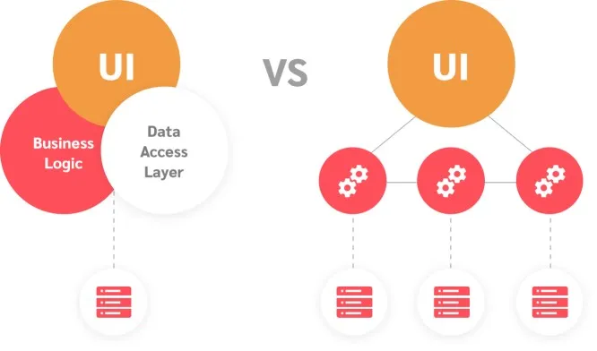
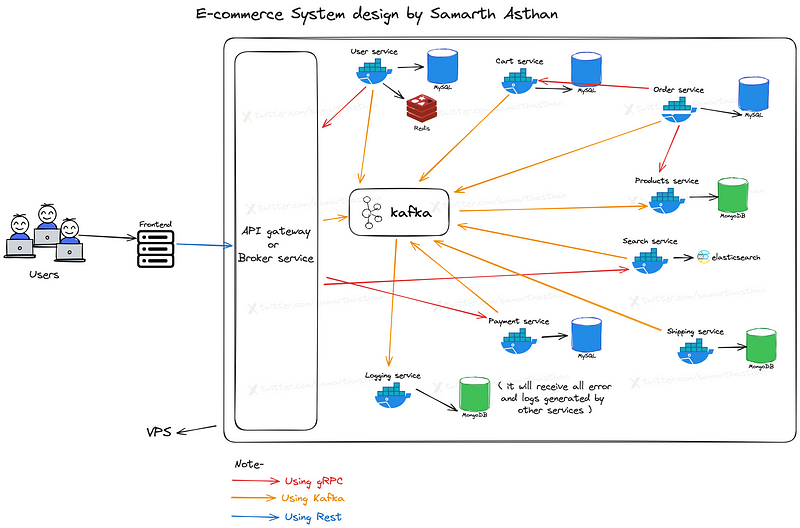

Hey everyone! I’m Samarth Asthan, a 3rd-year computer science student, and I’m new to the world of system design. But, I’m excited to share what I’ve learned about micro-services and how they play a crucial role in building robust and scalable e-commerce platforms.

## Table of contents

## What are Monolithic and Micro-services?

Imagine a big machine running all code on one machine, making it challenging to scale and address issues.

On the other hand, micro-services run multiple small backends on various machines, aiding scalability and easy management.

**Before going deep dive into design, let’s understand function and non-functional requirements for our design-**

**Functional requirements:**

1.  **User service:** Handles authentication, authorization, and user information tracking.
2.  **Product service:** Manages inventory, stock, and other product-related tasks.
3.  **Search service:** Facilitates product searching based on categories and other criteria.
4.  **Cart service:** Manages cart-related actions like adding to cart, moving to wishlist, etc.
5.  **Order service:** Crucial for order processing, distinct from other services for reliability.
6.  **Shipping service:** Tracks order status, cancellations, refunds, and related functionalities.
7.  **Payment service:** Acts as a liaison with external payment gateway providers, ensuring smooth transactions on our platform.
8.  **Logging service:** Vital for identifying and addressing issues in our services; maintaining detailed logs is crucial for the smooth operation of our platform.

**Non-functional requirements:**

1.  **Scale:** We can add or remove blocks as needed to handle more customers or traffic.
2.  **Availability:** If one block goes down, the others can still work.
3.  **Security:** We can focus on securing each block individually.

**Design:**

## User flow and micro-service communication:

**1\. Front-end:**

- Hosted separately on a platform like AWS EC2 or server-less AWS Lambda.
- Connects to the API Gateway using REST API calls.

**2\. API Gateway:**

- Acts as a broker, routing requests to appropriate micro-services.
- Utilizes either Apache Kafka or gRPC for communication, depending on the functionality.

**3\. Micro-services:**

- Each micro-service performs a specific task, like product management or order processing.
- Communicate with each other using gRPC or Apache Kafka, based on the request type.
- Produce and push all logs and errors to the Apache Kafka queue.

**4\. Logging Service:**

- Consumes messages from the “logging” topic of the Apache Kafka queue.
- Handles and processes all logs and errors received from micro-services.

**Overall communication flow:**

1.  User interacts with the front-end website.
2.  Front-end sends requests to the API Gateway.
3.  API Gateway routes the request to the appropriate micro-service(s).
4.  Micro-services communicate with each other as needed using gRPC or Kafka.
5.  All micro-services send logs and errors to the Kafka queue.
6.  The logging service processes and analyzes the logs and errors.

## Conclusion

I’m still learning about system design, but hopefully this basic idea gives you a good starting point for understanding how micro-services can help you build a better e-commerce platform.

This is just my current understanding, and I got some ideas from other sources too. There’s still a lot to learn and improve, but I’m excited about the possibilities of micro-services for e-commerce.

Stay tuned for more blog posts where we’ll talk more about individual micro-services, how they talk to each other, and how to build them!

Follow me on [**Twitter**](https://twitter.com/samarthasthan) for more back-end content! 🚀

<blockquote class="twitter-tweet">
🚀 Just did some quick math on server performance! 💻✨ A server with 36 cores and 256GB RAM can handle around 360 requests per second for CPU-bound tasks and a whopping 546,133 requests per second for memory-bound tasks. Mix &#39;em up, and you get about 270,000 requests per second!… <a href="https://t.co/m15eENhtF5">pic.twitter.com/m15eENhtF5</a>
&mdash; Samarth Asthan (@samarthasthan) <a href="https://twitter.com/samarthasthan/status/1731299091026726973?ref_src=twsrc%5Etfw">December 3, 2023</a></blockquote> 
