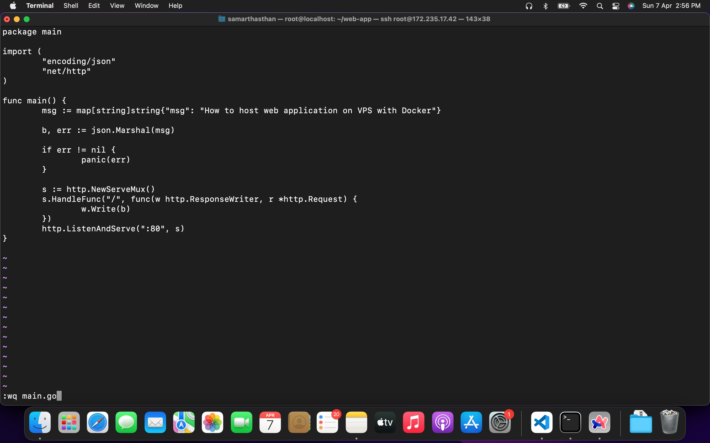
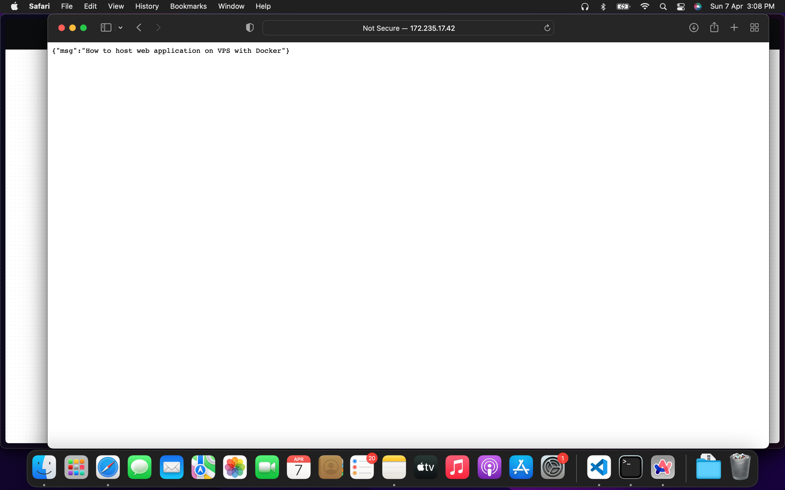

Today, we will learn how to host any web application on a VPS (Virtual Private Server) using Docker. By leveraging Docker containers, we can deploy our web application without the need for traditional web servers like Nginx or Apache.

## Table of contents

## Prerequisites:

Before we begin, ensure you have the following prerequisites:

1.  Access to a VPS (cloud server) with Docker installed. You can use pre-installed Docker servers like Linode's or set up Docker on cloud providers such as AWS or GCP.
2.  Web Application: Choose a web application you want to host. It can be a React app, a Node.js server, or any other type. In this tutorial, I'll be using a Golang server, but the process remains the same regardless of the type of server you're hosting.
3.  Dockerfile: For containerizing your application, you'll need a Dockerfile or Docker images of your application.

## Step 1: Set Up Your VPS

First, log in to your VPS using SSH or a remote desktop connection. Ensure Docker is installed on your VPS. You can verify Docker installation by running the command:

```json
docker --version
```

## Step 2: Build Your Docker Image

Now, create a Dockerfile in your web application directory. This file contains instructions for building your web application Docker image. Here's a sample Dockerfile for a simple Golang server:

```json
FROM golang:1.22.1-alpine3.19

WORKDIR /usr/src/web-app

COPY go.mod ./
RUN go mod download && go mod verify

COPY . .
RUN go build -v -o app ./

CMD ["./app"]
```

Once you've created the Dockerfile, it's time to build the Docker image from it using the following command:

```json
docker build -t webapp --lable webapp .
```

This command will build a Docker image named webapp based on the instructions in your Dockerfile.



## Step 3: Run Your Docker Container

Now that you've built your Docker image, you can run it as a Docker container on your VPS. Use the following command to run your container:

```json
docker run -d -p 80:80 webapp
```

This command will start a Docker container named my-web-app and map port 80 of the container to port 80 of your VPS. Adjust the port mapping as needed based on your application's configuration.

Now your web application is hosted on your VPS using Docker without the need for additional web servers. You can access your web application by navigating to your VPS's IP address or domain name in your web browser.



## Conclusion:

In this tutorial, we've learned how to host web applications on a VPS using Docker without the need for additional web servers like Nginx or Apache. Docker simplifies the deployment process and enhances flexibility, making it easier to deploy and manage web applications on a VPS.

Thank you for following along! Happy hosting!
