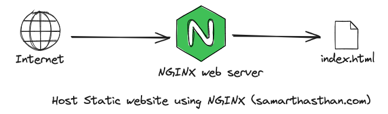
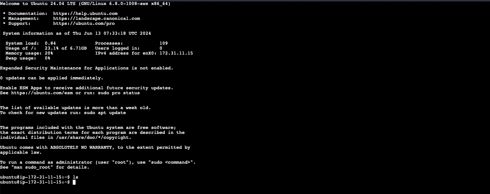
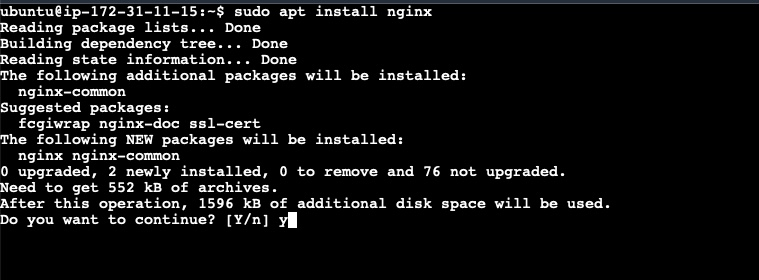
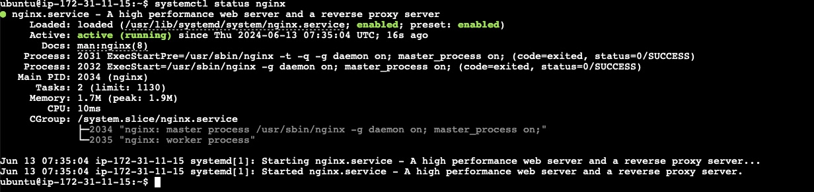
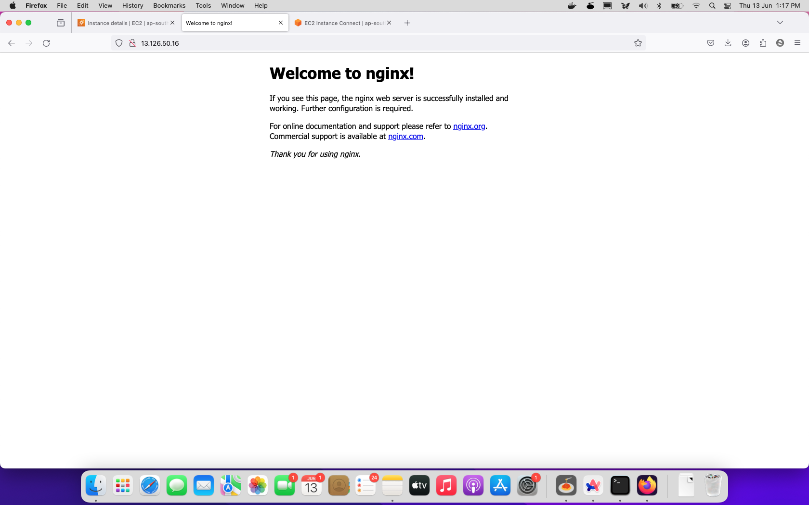
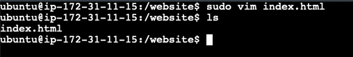
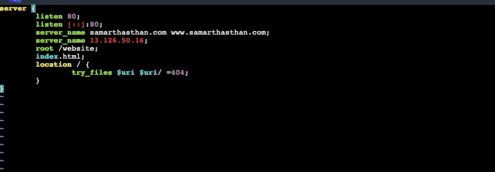
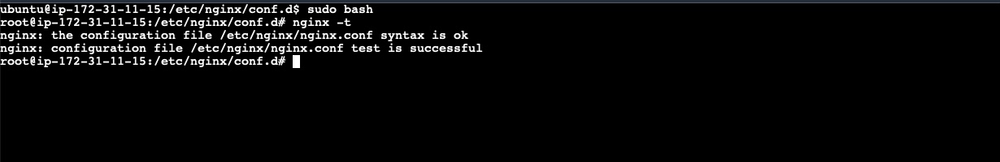
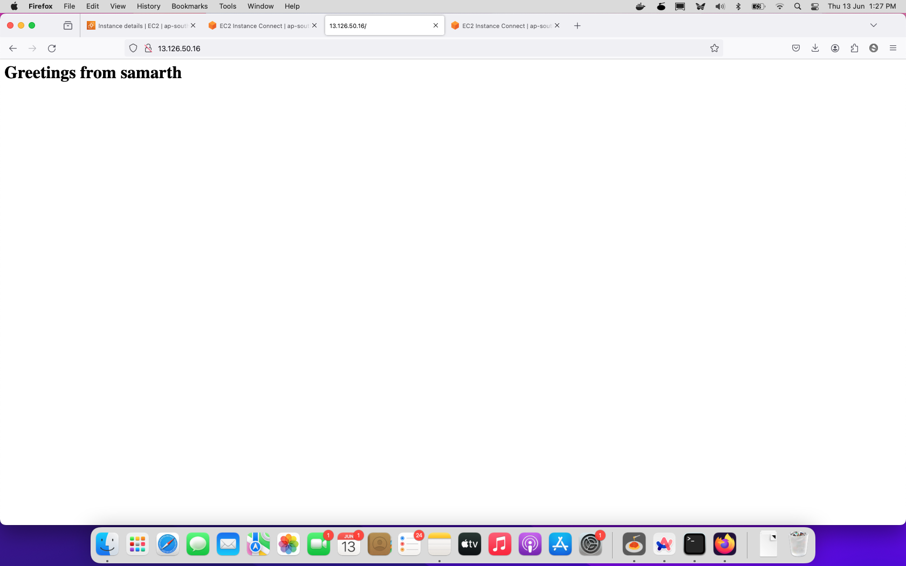

Hey folks, I'm Samarth Asthan, a 4th-year computer science student, and today we will see how to host a static website using NGINX. NGINX can be used for many things like web servers, reverse proxy, and much more.

## Table of contents

## Prerequisites:

1. You should have basic knowledge of any hosting provider (I will be using AWS for demonstration)
2. You should have basic knowledge of how the internet works
3. You should have a website that you want to host

## How NGINX works for static websites?



1. When a request for a static file is received, NGINX looks for the file in its configured root directory.
2. If the file is found, NGINX sends it directly to the client without any additional processing.

## Step 1: Login into your server

You can use a PEM or PPK key to log into your server, or you can use `ssh root@password`.



## Step 2: Install NGINX on your system

Run and follow the commands below to install NGINX on your system:

1. Go into root mode using sudo bash:

   ```bash
   sudo bash
   ```

2. Update your dependencies:

   ```bash
   apt update
   ```

3. Install NGINX using apt install:

   ```bash
   apt install nginx
   ```

   It will ask you for yes or no, type `y` and press enter.

   

4. Now check if NGINX is installed and working:

   ```bash
   systemctl status nginx
   ```

   You should see `active (running)` status.

   

   Or you can check by visiting your server's public IP using a browser.

   

## Step 3: Copy your website to the server

1. You can use git to clone your website to the server.
2. In this case, I will create a basic HTML file using vim.

   

## Step 4: Configure NGINX to serve our static website

1. Go to the NGINX directory:

   ```bash
   cd /etc/nginx
   cd conf.d
   ```

2. Now create an NGINX conf file for your website (use your website name as the conf name, recommended):

   ```bash
   touch samarthasthan.com.conf
   ```

3. Now edit the conf file using vim:

   ```bash
   vim samarthasthan.com.conf
   ```

4. Write the configuration inside it:

   

   - `listen` specifies the port on which NGINX should listen and serve. As we are using HTTP, it should listen on port 80.
   - `server_name` specifies the address that should be detected and served. It should be your domain name, but for demonstration, I am using my server's public IP.
   - `root` specifies the directory of your website.
   - `index` specifies the starting point of your website, generally it's `index.html`, but you can change it according to your needs.

   ```nginx
   server {
       listen 80;
       listen [::]:80;
       server_name samarthasthan.com www.samarthasthan.com;
       server_name 13.126.50.16;
       root /website;
       index index.html;

       location / {
           try_files $uri $uri/ =404;
       }
   }
   ```

5. Save and quit vim using:

   ```bash
   :wq
   ```

## Step 5: Test NGINX conf and restart NGINX to load your website

1. Now check if there is any syntax mistake in your conf file by running:

   ```bash
   nginx -t
   ```

   You should see an `ok` status.

   

2. Now you have to restart NGINX to apply the new conf files:

   ```bash
   systemctl restart nginx
   ```

## Step 6: Enjoy your website

Now you can go to your domain name or server's public IP. You should be able to see your website instead of the default NGINX page.



## Conclusion

Hosting a static website using NGINX is a straightforward process that involves setting up a server, installing NGINX, and configuring it to serve your website files. With its efficient handling of static content, NGINX ensures that your website loads quickly and reliably. By following this step-by-step guide, you can easily deploy your static website and make it accessible to the world. Happy hosting!

Stay tuned for more blog posts where we’ll talk more about individual micro-services, how they talk to each other, and how to build them!

Follow me on [**Twitter**](https://twitter.com/samarthasthan) for more back-end content! 🚀

<blockquote class="twitter-tweet"><p lang="en" dir="ltr">Hey developers! I just finished drafting a high-level design for my upcoming multi-vendor e-commerce project. I would greatly appreciate any feedback or suggestions for improvement. <a href="https://twitter.com/hashtag/100DaysOfCode?src=hash&amp;ref_src=twsrc%5Etfw">#100DaysOfCode</a> <a href="https://twitter.com/hashtag/SystemDesign?src=hash&amp;ref_src=twsrc%5Etfw">#SystemDesign</a> <a href="https://twitter.com/hashtag/Docker?src=hash&amp;ref_src=twsrc%5Etfw">#Docker</a> <a href="https://twitter.com/hashtag/GoLang?src=hash&amp;ref_src=twsrc%5Etfw">#GoLang</a> <a href="https://t.co/HQjhcSld2h">pic.twitter.com/HQjhcSld2h</a></p>&mdash; Samarth Asthan (@samarthasthan) <a href="https://twitter.com/samarthasthan/status/1758929187719516397?ref_src=twsrc%5Etfw">February 17, 2024</a></blockquote> <script async src="https://platform.twitter.com/widgets.js" charset="utf-8"></script>
